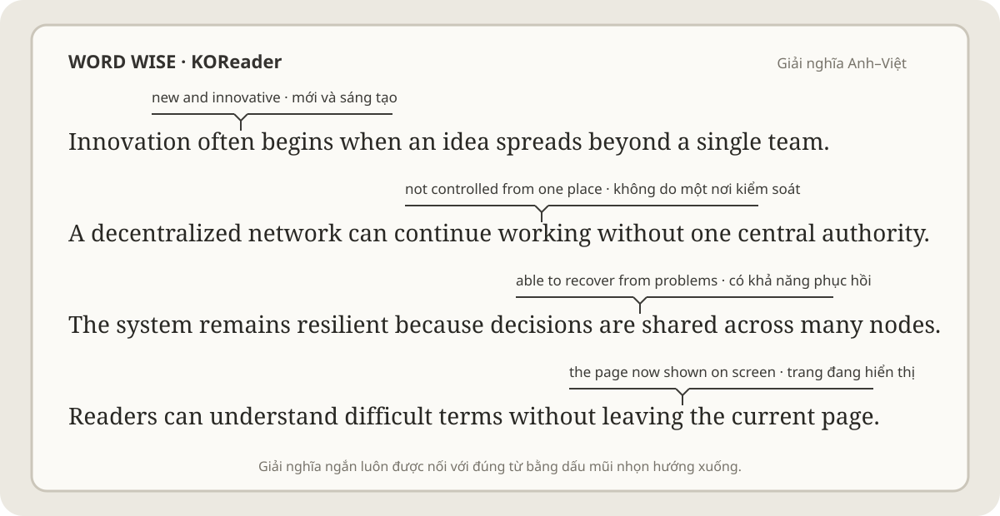
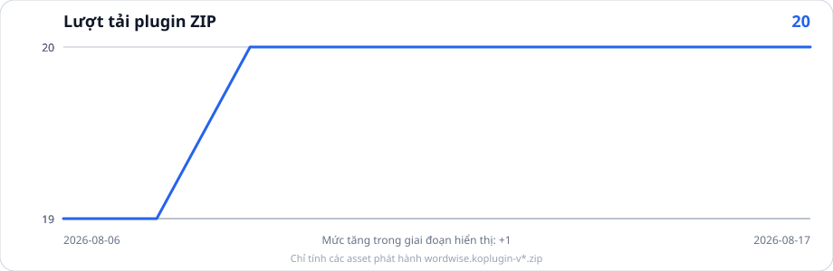

# Word Wise Anh–Việt cho KOReader

**Hiển thị giải nghĩa Anh–Việt ngay phía trên những từ và cụm từ khó khi bạn đọc sách bằng KOReader.**

[](https://github.com/trigon1998/wordwise.koplugin-custom/releases)
[](https://github.com/trigon1998/wordwise.koplugin-custom/actions/workflows/ci.yml)
[](stats/downloads.svg)
[](https://github.com/trigon1998/wordwise.koplugin-custom/stargazers)

<p align="center">
  
</p>

## Word Wise là gì?

Word Wise là plugin dành cho người đọc sách tiếng Anh bằng KOReader. Plugin chỉ
quét trang đang hiển thị, tìm những từ hoặc cụm từ khó phù hợp rồi đặt giải
nghĩa ngắn ngay phía trên văn bản. Đường ngang và dấu mũi nhọn hướng xuống giúp
xác định chính xác từ đang được giải thích mà không cần rời khỏi trang sách để
mở từ điển.

**Phiên bản candidate hiện tại:** `2026.07.1-rc1.4.5`
**Kênh cập nhật:** bản thử nghiệm RC

## Tính năng nổi bật

| Tính năng | Công dụng |
|---|---|
| Giải nghĩa ngay trên trang | Hiển thị định nghĩa tiếng Anh ngắn và bản dịch tiếng Việt đã được rà soát |
| Nhận diện cụm từ | Có thể nhận diện cụm từ dài tối đa 5 từ, không chỉ từng từ riêng lẻ |
| Ba lĩnh vực | Cơ sở dữ liệu Tổng quát, Kinh tế và Vật lý |
| Chọn nghĩa theo ngữ cảnh | Dùng các từ xung quanh để chọn gloss primary/alternate phù hợp hơn; chỉ dùng alternate khi có evidence rõ hơn |
| Từ đã biết | Cho phép ẩn những từ bạn đã biết và dùng chung danh sách này giữa các sách |
| Dấu chỉ từ trực quan | Đường ngang và dấu mũi nhọn hướng xuống chỉ đúng từ đang được giải thích |
| Cập nhật OTA đầy đủ | Cập nhật cả plugin và ba cơ sở dữ liệu ngay trong menu Word Wise |
| Khôi phục an toàn | Luôn tạo bản sao lưu và không đụng đến tiến độ đọc, sidecar hay `known_words.db` |

## Khả năng tương thích

Plugin được thiết kế cho:

- tài liệu có thể dàn lại trang bằng CREngine của KOReader, chẳng hạn EPUB và HTML;
- thiết bị đọc sách chạy Android;
- được kiểm tra chủ yếu với KOReader 2026.03 “Snowflake” trên iReader Ocean 5 Pro.

Các tài liệu bố cục cố định như PDF, DJVU và truyện tranh không được hỗ trợ bởi
cơ chế xác định tọa độ từ trên trang.

## Cài đặt và cập nhật

### Đang sử dụng Word Wise

Mở:

```text
Word Wise → Updates → Check for updates
```

Đối với bản RC, bật **Include prerelease/RC updates**, sau đó chọn
**Update all and restart**.

Trước khi cài đặt, trình cập nhật sẽ kiểm tra:

- ZIP plugin;
- ZIP cơ sở dữ liệu;
- SHA-256;
- manifest;
- tính toàn vẹn SQLite;
- sự khớp phiên bản giữa plugin và database.

### Cài đặt lần đầu

1. Mở trang [Releases](https://github.com/trigon1998/wordwise.koplugin-custom/releases).
2. Tải ZIP plugin và ZIP cơ sở dữ liệu có cùng số phiên bản.
3. Thoát hoàn toàn khỏi KOReader.
4. Chép thư mục `wordwise.koplugin` đã giải nén vào `koreader/plugins/`.
5. Giải nén gói cơ sở dữ liệu vào thư mục đang chứa `koreader/`.
6. Khởi động lại KOReader.
7. Mở **Word Wise → Diagnostics** và kiểm tra phiên bản plugin cùng phiên bản cơ sở dữ liệu phải trùng nhau.

Không xóa hoặc thay thế:

```text
<KOReader data>/wordwise/known_words.db
```

## Hướng dẫn sử dụng

### 1. Bật Word Wise cho một cuốn sách

Mở một sách tiếng Anh được KOReader xử lý ở chế độ reflowable, sau đó vào:

```text
Word Wise → Enable inline hints
```

Khi Word Wise được bật, plugin sẽ phân tích trang đang hiển thị và tự chèn
giải nghĩa phía trên một số từ hoặc cụm từ khó.

Word Wise không sửa nội dung file sách. Các hint chỉ được vẽ thêm trên giao
diện khi đọc.

### 2. Chọn loại nội dung của sách

Ở lần thiết lập đầu tiên cho một cuốn sách, Word Wise có thể đề xuất một trong
ba cơ sở dữ liệu:

- **General** — sách văn học, phi hư cấu và nội dung tiếng Anh thông thường;
- **Economics** — kinh tế, tài chính, kinh doanh;
- **Physics** — vật lý và nội dung khoa học liên quan.

Plugin sẽ phân tích một phần nội dung và thông tin của sách để đưa ra lựa chọn
gợi ý. Bạn vẫn có thể chọn database khác nếu thấy phù hợp hơn.

Thiết lập này được lưu riêng cho từng cuốn sách.

### 3. Điều chỉnh số lượng từ được giải nghĩa

Vào:

```text
Word Wise → Hint level
```

Word Wise có 5 mức:

```text
1 — chỉ hiện những từ hiếm/khó nhất
2 — ít hint
3 — trung bình
4 — nhiều hint
5 — nhiều hint nhất
```

Mức càng cao thì càng nhiều từ đủ điều kiện xuất hiện giải nghĩa.

Mặc định:

```text
General   → Level 2
Economics → Level 3
Physics   → Level 3
```

Nếu cảm thấy trang quá nhiều chữ phụ, nên giảm `Hint level` thay vì tắt hoàn
toàn Word Wise.

### 4. Đọc một hint

Mỗi hint gồm phần định nghĩa tiếng Anh ngắn, giải nghĩa tiếng Việt nếu có, cùng
một đường ngang và dấu mũi nhọn hướng xuống từ đang được giải thích.

Một số mục từ có thể chỉ hiện tiếng Anh nếu chưa có bản dịch tiếng Việt đã được
xác minh phù hợp.

### 5. Chạm vào hint để xem thêm

Mặc định, tùy chọn:

```text
Quick tap opens Word Wise popup
```

được bật.

Chạm trực tiếp vào một hint để mở cửa sổ chi tiết. Tại đây có thể xem thêm
thông tin của mục từ và mở từ điển KOReader.

Bạn cũng có thể đánh dấu:

```text
Known in [domain]
```

để coi từ đó là đã biết trong database hiện tại, hoặc:

```text
Known in all domains
```

để ẩn từ đó trong tất cả các lĩnh vực.

Sau khi được đánh dấu là từ đã biết, Word Wise sẽ không tiếp tục hiển thị hint
cho từ đó ở những trang sau.

### 6. Điều chỉnh kích thước và font của hint

Trong menu Word Wise có thể thay đổi font và kích thước chữ dùng cho phần giải
nghĩa.

Kích thước hint hỗ trợ từ `10` đến `18`, mặc định là `13`.

Có thể dùng font riêng của giao diện hoặc chọn sử dụng cùng font với cuốn sách.
Thiết lập font và kích thước hint áp dụng chung cho Word Wise, không chỉ riêng
một cuốn sách.

### 7. Khoảng cách dòng

Để dành đủ không gian cho phần giải nghĩa phía trên từ, RC1.3.9 mặc định sử dụng:

```text
Word Wise → Line spacing → Automatic
```

Ở chế độ này Word Wise đặt khoảng cách dòng mục tiêu ở `180%`. Đây là thiết lập
được khuyến nghị.

Khi tắt Word Wise, plugin sẽ cố gắng khôi phục khoảng cách dòng mà cuốn sách sử
dụng trước đó.

Nếu muốn tự điều chỉnh khoảng cách dòng, có thể chuyển khỏi `Automatic`, nhưng
khoảng cách quá hẹp có thể khiến một số hint không đủ chỗ để hiển thị.

### 8. Thiết lập được lưu như thế nào?

Các thiết lập liên quan trực tiếp đến từng cuốn sách như database, hint level,
bật/tắt Word Wise, quick tap và line spacing của Word Wise được lưu theo cuốn
sách trong hệ thống sidecar của KOReader.

Danh sách từ đã biết được lưu riêng tại:

```text
<KOReader data>/wordwise/known_words.db
```

và có thể được sử dụng giữa nhiều cuốn sách.

Font và kích thước chữ của hint là thiết lập chung của plugin.

### 9. Kiểm tra Word Wise có hoạt động đúng không

Mở:

```text
Word Wise → Diagnostics
```

Một số thông tin hữu ích gồm `Domain`, `Database build`, `Hint level`,
`Current line spacing`, `Page hints` và `Hint render`.

Ví dụ:

```text
Hint render: 3 matched · 3 placed · 0 hidden
```

có nghĩa là Word Wise tìm được 3 hint và cả 3 đều đã được đặt thành công lên
trang.

`Performance counters` chủ yếu dành cho kiểm tra và phát triển. Người dùng
thông thường không cần bật tùy chọn này.

### 10. Cách thiết lập khuyến nghị

Đối với sách tiếng Anh thông thường:

```text
Database: General
Hint level: 2
Line spacing: Automatic
Quick tap: On
Hint font size: 13
Performance counters: Off
```

Nếu đang đọc sách chuyên ngành kinh tế hoặc vật lý, chuyển database tương ứng
và bắt đầu với `Hint level 3`, sau đó tăng hoặc giảm theo độ khó của sách.

## Dữ liệu của bạn được bảo vệ như thế nào?

Git repository này chỉ chứa mã nguồn plugin. Các cơ sở dữ liệu từ điển được
đính kèm riêng trong GitHub Releases.

Bản cập nhật chỉ được phép thay thế:

```text
koreader/plugins/wordwise.koplugin/
koreader/wordwise/databases/wordwise_general.db
koreader/wordwise/databases/wordwise_economics.db
koreader/wordwise/databases/wordwise_physics.db
```

Trình cập nhật **không đóng gói hoặc thay thế**:

- `known_words.db`;
- tiến độ đọc;
- phần tô sáng và ghi chú;
- sidecar riêng của từng sách;
- các thiết lập KOReader không liên quan.

Plugin chỉ kết nối tới GitHub khi bạn chủ động kiểm tra cập nhật và không lưu
GitHub Personal Access Token trên thiết bị đọc sách.

## Thống kê lượt tải

[](stats/downloads.json)

## Phiên bản candidate hiện tại: RC1.4.5 Coverage Correction

RC1.4.5 giữ cơ chế **top-edge hint fallback** của RC1.3.6 và cơ chế chọn gloss theo ngữ cảnh của RC1.3.9. Với các entry có sense2 đã được review, plugin chấm riêng keyword của sense primary và alternate trong cửa sổ context ±10 token; alternate chỉ thắng khi điểm cao hơn nghiêm ngặt và lớn hơn 0. Khi hòa hoặc không có evidence, plugin giữ primary để tránh thay đổi không chắc chắn.

Database General trong candidate này bổ sung **538 gloss Việt** có source Wiktionary, **92 phrase/collocation** đã được chọn lọc và coverage reviewed cho `dawdle`; các dạng `dawdling`, `dawdled`, `dawdles` được ánh xạ về lemma này. Số entry có gloss Việt tăng từ 48 lên 679, phrase tăng từ 0 lên 92. Economics và Physics giữ nguyên gloss/domain data hiện có, không nhận nhầm General gloss chỉ vì trùng term. Ba database dùng hybrid `min(CEFR difficulty, frequency difficulty)` với wordfreq 3.1.1, lemma normalization, phrase-conservative policy và CEFR fallback khi Zipf bằng 0. Không có bản dịch Việt mới nào được mô hình tự sinh.

Nguồn Wiktionary được ghi per-term trong override TSV; attribution/share-alike notice nằm trong README và manifest của database bundle để tương thích trực tiếp với updater cũ. RC1.4.4 là bridge updater code-only; RC1.4.5 kế thừa capability schema-v2/schema-v3, tách validator theo layout và lưu schema metadata trong pending/backup state. RC1.4.5 bổ sung coverage entry có bản dịch tiếng Việt đã review, đồng thời chỉ tạo inline hint khi gloss Việt có nội dung. Entry English-only như `haven` vẫn tra thủ công được nhưng không còn xuất hiện tự động trong Word Wise. Candidate vẫn cần được kiểm tra thực tế trước khi thay thế release công khai.

Thứ tự ưu tiên khi đặt hint:

1. giữ cách hiển thị bình thường phía trên từ;
2. nếu chỉ vượt mép trên một ít, dịch hint xuống vừa đủ nhưng vẫn giữ dấu mũi
   nhọn ở phía trên từ;
3. nếu phía trên không còn đủ chỗ, chuyển riêng hint đó xuống dưới dòng và dùng
   dấu mũi nhọn hướng lên để chỉ lại đúng từ;
4. chỉ ẩn hint khi cả hai vị trí đều không thể đặt an toàn trên màn hình.

Renderer vẫn giữ khoảng cách dòng tự động 180%, font-level metrics, giới hạn

theo cột văn bản và kiểm tra va chạm giữa các hint. Database schema v3 thêm cột context cho sense2; runtime vẫn tự động fallback để đọc schema v2 của các database cũ. RC1.4.5 phát hành code cùng database schema-v2 legacy-safe; runtime vẫn có thể đọc schema-v3. Database bundle không chứa `known_words.db`, sidecar hay tiến độ đọc. Các mapping source-backed được giữ trong data README/manifest và không có bản dịch Việt nào được tự sinh.

Xem trang [Releases](https://github.com/trigon1998/wordwise.koplugin-custom/releases)
để tải file, kiểm tra checksum và đọc ghi chú phát hành.

## Xử lý sự cố

### Diagnostics tìm thấy hint nhưng không hiển thị

Mở **Word Wise → Diagnostics** và kiểm tra:

```text
Hint render: … matched · … placed · … hidden
```

Khi `Page hints` lớn hơn 0, trang hoạt động bình thường cần có ít nhất một hint
ở trạng thái `placed`.

### Khôi phục phiên bản trước

Mở:

```text
Word Wise → Updates → Restore previous version
```

Các bản sao lưu nằm trong thư mục cập nhật Word Wise của KOReader.
`known_words.db` và sidecar sách không thuộc phạm vi thay thế của updater.

### Khoảng cách dòng quá rộng

RC1.4.3 chủ động dùng khoảng cách dòng tự động 180% để dành đủ vùng hiển thị
cho hint. Tắt tự động điều chỉnh khoảng cách hoặc tắt Word Wise để khôi phục
khoảng cách dòng ban đầu đã được ghi nhớ.

## Tài liệu kỹ thuật

Các tài liệu dành cho phát triển và bảo trì:

- [Tài liệu kỹ thuật và lịch sử phát hành](docs/TECHNICAL_REFERENCE.md)
- [Quy trình bảo trì dữ liệu](DATA_MAINTENANCE.md)
- [Kiểm tra hiệu năng](PERFORMANCE_TEST.md)
- [Thông báo về repository](NOTICE.md)

`docs/TECHNICAL_REFERENCE.md` giữ nguyên nội dung kỹ thuật và lịch sử cũ để
không làm mất thông tin phát triển.

## Miễn trừ trách nhiệm

Dự án này được phát triển nhằm mục đích **nghiên cứu, học tập, thử nghiệm kỹ thuật và sử dụng cá nhân**.

Dự án **không phục vụ mục đích thương mại**, không cung cấp dịch vụ trả phí và không nhằm tạo ra lợi nhuận từ phần mềm, dữ liệu hoặc các thành phần liên quan.

Phần mềm được cung cấp theo hiện trạng để phục vụ thử nghiệm. Người sử dụng tự chịu trách nhiệm đối với việc cài đặt, sử dụng, chỉnh sửa và sao lưu dữ liệu trên thiết bị của mình.

Word Wise trong repository này là một dự án cộng đồng/cá nhân và không phải là sản phẩm thương mại chính thức.

## Ghi nhận và trạng thái phân phối

Đây là bản fork bảo trì chỉ chứa mã nguồn, được phát triển từ
[`asxelot/wordwise.koplugin`](https://github.com/asxelot/wordwise.koplugin).

